# Class类源码阅读

## 官方文档简介：

​		Instances of the class Class represent classes and interfaces in a running Java application. An enum is a kind of class and an annotation is a kind of interface. Every array also belongs to a class that is reflected as a Class object that is shared by all arrays with the same element type and number of dimensions. The primitive Java types (boolean, byte, char, short, int, long, float, and double), and the keyword void are also represented as Class objects.

​		Class表示正在运行的Java应用程序中的类和接口。枚举是一种类，注释是一种接口。与数组所属的所有数组的一个类所反映的数组是同一个类，也是同一个类所反映的。原始Java类型（boolean、byte、char、short、int、long、float和double）以及关键字void也表示为类对象。


## 先制作一个bean

```java
/**
 * Description:
 * date: 2020-12-18
 *
 * @author xumu
 */
public class ReflectBeanDemo {
    private String name;
    private String age;
    public String openName;
    public String openAge;
    public void openFun1(){}
    private void fun1(){}
}
```

# static method

## toClass()

```java
private static Class<?> toClass(Type o) {
    if (o instanceof GenericArrayType)
        return Array.newInstance(toClass(((GenericArrayType)o).getGenericComponentType()),
                                 0)
            .getClass();
    return (Class<?>)o;
 }
```

获得Class对象

## forName()

```java
@CallerSensitive
    public static Class<?> forName(String className)
                throws ClassNotFoundException {
        Class<?> caller = Reflection.getCallerClass();
        return forName0(className, true, ClassLoader.getClassLoader(caller), caller);
    }
```

returns:

 the Class object for the class with the specified name.


## isAsciiDigit

```java
private static boolean isAsciiDigit(char c) {
    return '0' <= c && c <= '9';
}
```

Results:

answers true to some non-ascii digits. This one does not.

# Method

## Class()

```java
private Class(ClassLoader loader) {
    // Initialize final field for classLoader.  The initialization value of non-null
    // prevents future JIT optimizations from assuming this final field is null.
    classLoader = loader;
}
```

Private constructor. Only the Java Virtual Machine creates Class objects.This constructor is not used and prevents the default constructor beinggenerated.


## toString()

```java
/**
     * Converts the object to a string. The string representation is the
     * string "class" or "interface", followed by a space, and then by the
     * fully qualified name of the class in the format returned by
     * {@code getName}.  If this {@code Class} object represents a
     * primitive type, this method returns the name of the primitive type.  If
     * this {@code Class} object represents void this method returns
     * "void".
     *
     * @return a string representation of this class object.
     */
public String toString() {
    return (isInterface() ? "interface " : (isPrimitive() ? "" : "class "))+ getName();
}
```

returns:

 a string representation of this class object.


## toGenericString()

```java
/**
     * Returns the {@code Class} object associated with the class or
     * interface with the given string name.  Invoking this method is
     * equivalent to:
     *
     * <blockquote>
     *  {@code Class.forName(className, true, currentLoader)}
     * </blockquote>
     *
     * where {@code currentLoader} denotes the defining class loader of
     * the current class.
     *
     * <p> For example, the following code fragment returns the
     * runtime {@code Class} descriptor for the class named
     * {@code java.lang.Thread}:
     *
     * <blockquote>
     *   {@code Class t = Class.forName("java.lang.Thread")}
     * </blockquote>
     * <p>
     * A call to {@code forName("X")} causes the class named
     * {@code X} to be initialized.
     */
public String toGenericString() {}
```

returns:

 the Class object for the class with the specified name.


## newInstance()

returns:

一个空参构造函数构造的对象

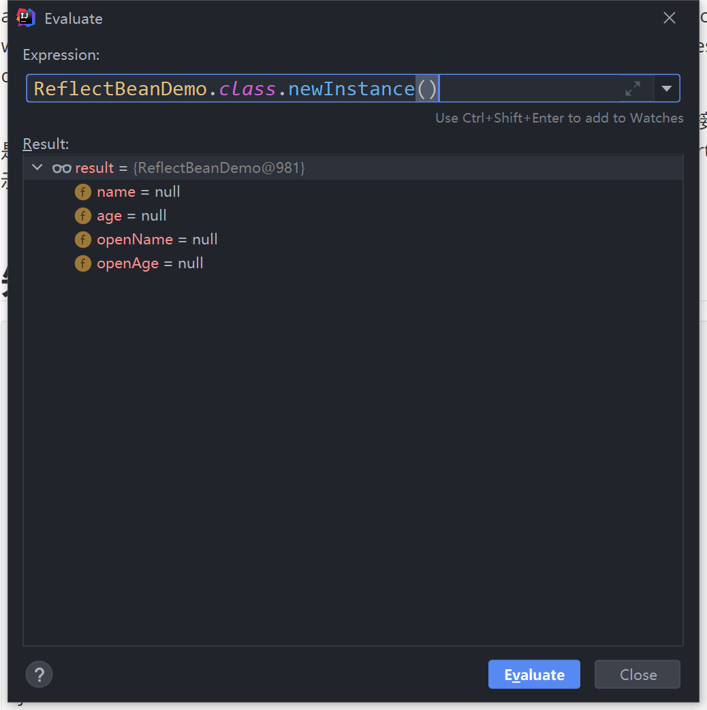


## isAnnotation()

```java
public boolean isAnnotation() {
    return (getModifiers() & ANNOTATION) != 0;
}
```

Returns:
true if this class object represents an annotation type; false otherwise

## isSynthetic()

```java
public boolean isSynthetic() {
    return (getModifiers() & SYNTHETIC) != 0;
}
```

Returns:
true if and only if this class is a synthetic class as defined by the Java Language Specification.

> 参考https://www.cnblogs.com/bethunebtj/p/7761596.html

## getName()

```java
public String getName() {
    String name = this.name;
    if (name == null)
        this.name = name = getName0();
    return name;
}
```

```java
Examples:
String.class.getName()
    returns "java.lang.String"
byte.class.getName()
    returns "byte"
(new Object[3]).getClass().getName()
    returns "[Ljava.lang.Object;"
(new int[3][4][5][6][7][8][9]).getClass().getName()
    returns "[[[[[[[I"
```

Returns:
the name of the class or interface represented by this object.

## getClassLoader()

```java
@CallerSensitive
public ClassLoader getClassLoader() {
    ClassLoader cl = getClassLoader0();
    if (cl == null)
        return null;
    SecurityManager sm = System.getSecurityManager();
    if (sm != null) {
        ClassLoader.checkClassLoaderPermission(cl, Reflection.getCallerClass());
    }
    return cl;
}
```

Returns:
the class loader that loaded the class or interface represented by this object.

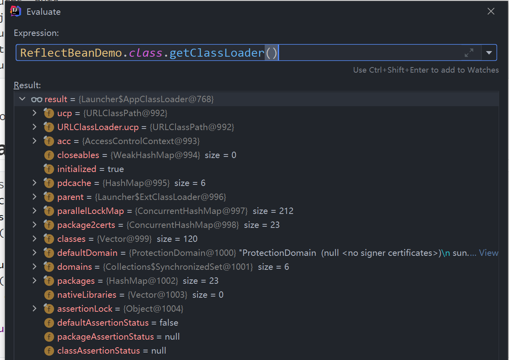


## getClassLoader0()

```java
ClassLoader getClassLoader0() { return classLoader; }
```

> Package-private to allow ClassLoader access

## getTypeParameters()

```java
public TypeVariable<Class<T>>[] getTypeParameters() {
    ClassRepository info = getGenericInfo();
    if (info != null)
        return (TypeVariable<Class<T>>[])info.getTypeParameters();
    else
        return (TypeVariable<Class<T>>[])new TypeVariable<?>[0];
}
```

Returns:
an array of TypeVariable objects that represent the type variables declared by this generic declaration

获取泛型类型


## getGenericSuperclass()

```java
public Type getGenericSuperclass() {
    ClassRepository info = getGenericInfo();
    if (info == null) {
        return getSuperclass();
    }

    // Historical irregularity:
    // Generic signature marks interfaces with superclass = Object
    // but this API returns null for interfaces
    if (isInterface()) {
        return null;
    }

    return info.getSuperclass();
}
```

Returns:
the superclass of the class represented by this object


## getPackage()

```java
public Package getPackage() {
    return Package.getPackage(this);
}
```

Returns:
the package of the class, or null if no package information is available from the archive or codebase.

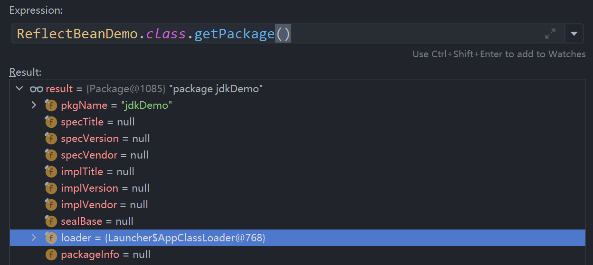

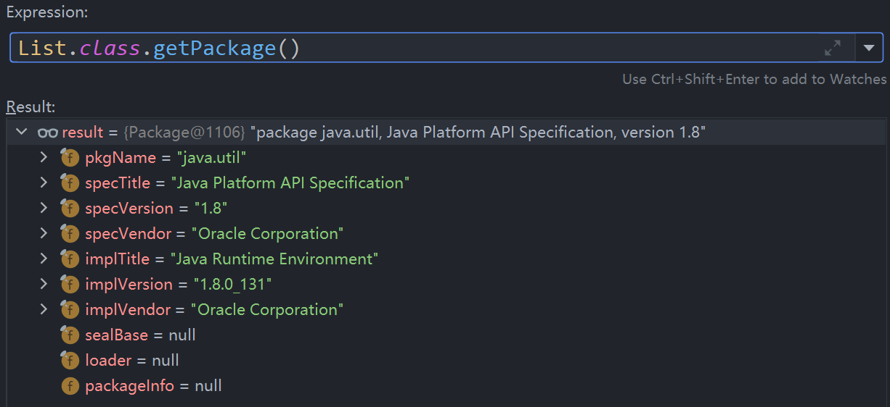

## getInterfaces()

```java
public Class<?>[] getInterfaces() {
    ReflectionData<T> rd = reflectionData();
    if (rd == null) {
        // no cloning required
        return getInterfaces0();
    } else {
        Class<?>[] interfaces = rd.interfaces;
        if (interfaces == null) {
            interfaces = getInterfaces0();
            rd.interfaces = interfaces;
        }
        // defensively copy before handing over to user code
        return interfaces.clone();
    }
}
```

Returns:
an array of interfaces implemented by this class.

## getGenericInterfaces()

```java
public Type[] getGenericInterfaces() {
    ClassRepository info = getGenericInfo();
    return (info == null) ?  getInterfaces() : info.getSuperInterfaces();
}
```

Returns:
an array of interfaces implemented by this class

Generic(泛型)特殊处理，ParameterizedType表示参数化类型，直白点将就是包含泛型的类型，例如ArrayList\<String>,Set\<Integer>

对比图：

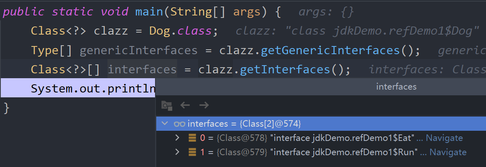


<a href="##refDemo1">点击跳转demo源代码</a>

## getEnclosingMethod()

```java
public Method getEnclosingMethod() throws SecurityException
```

Returns:
the immediately enclosing method of the underlying class, if that class is a local or anonymous class; otherwise null.

## getEnclosingMethodInfo()

```java
private EnclosingMethodInfo getEnclosingMethodInfo() {
    Object[] enclosingInfo = getEnclosingMethod0();
    if (enclosingInfo == null)
        return null;
    else {
        return new EnclosingMethodInfo(enclosingInfo);
    }
```

## getEnclosingConstructor()

```java
public Constructor<?> getEnclosingConstructor() throws SecurityException
```

Returns:
the immediately enclosing constructor of the underlying class, if that class is a local or anonymous class; otherwise null.

此方法的返回类型为Constructor ，当此类是本地或匿名类时，它将返回最近封闭的基础类的构造函数。

[点击查看实例代码](##refDemo2)

## getDeclaringClass()

```java
public Class<?> getDeclaringClass() throws SecurityException {
        final Class<?> candidate = getDeclaringClass0();

        if (candidate != null)
            candidate.checkPackageAccess(
                    ClassLoader.getClassLoader(Reflection.getCallerClass()), true);
        return candidate;
    }
```

Returns:
the declaring class for this class

## getEnclosingClass()

```java
public Class<?> getEnclosingClass() throws SecurityException 
```

Returns:
the immediately enclosing class of the underlying class

如果一个class表示在方法中的一个本地或匿名class, 那么通过java.lang.Class.getEnclosingClass()方法将返回的底层类的立即封闭类。 反之则为NULL。

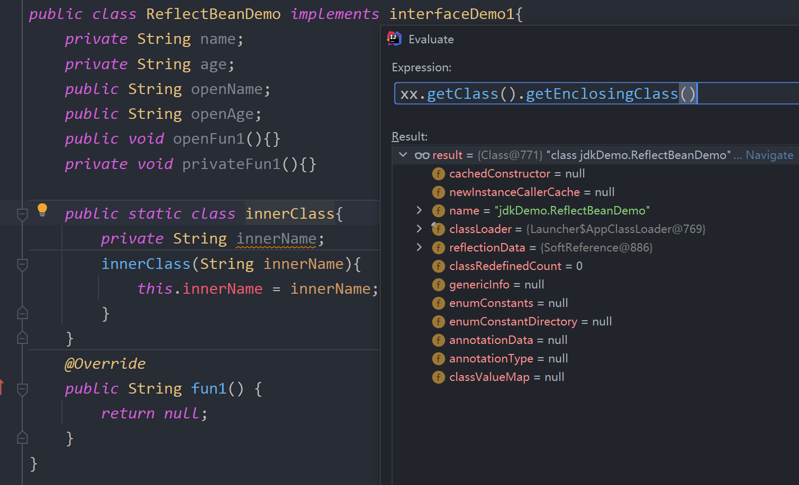

## getSimpleName()

```java
public String getSimpleName() {
    if (isArray())
        return getComponentType().getSimpleName()+"[]";

    String simpleName = getSimpleBinaryName();
    if (simpleName == null) { // top level class
        simpleName = getName();
        return simpleName.substring(simpleName.lastIndexOf(".")+1); // strip the package name
    }
    int length = simpleName.length();
        if (length < 1 || simpleName.charAt(0) != '$')
            throw new InternalError("Malformed class name");
        int index = 1;
        while (index < length && isAsciiDigit(simpleName.charAt(index)))
            index++;
        // Eventually, this is the empty string iff this is an anonymous class
        return simpleName.substring(index);
    }
```

Returns:

the simple name of the underlying class as given in the source code. Returns an empty string if the underlying class is anonymous.

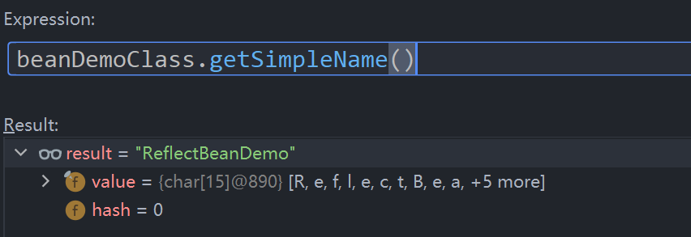

## getTypeName

```java
public String getTypeName() 
```

Returns:
an informative string for the name of this type


## getCanonicalName()

```java
public String getCanonicalName() {
```

Returns:

the canonical（规范） name of the underlying class as defined by the Java Language Specification. Returns null if the underlying class does not have a canonical name (i.e., if it is a local or anonymous class or an array whose component type does not have a canonical name).

> 强烈推荐https://blog.csdn.net/zq1994520/article/details/78942684

## isAnonymousClass()

```java
public boolean isAnonymousClass() {
    return "".equals(getSimpleName());
}
```

## isLocalClass()

```java
public boolean isLocalClass() {
    return isLocalOrAnonymousClass() && !isAnonymousClass();
}
```

[LocalClass参考资料](##java中五种类)

top level class（普通类）

nested class (静态内部类)

inner class(非静态内部类)

local class(在方法内定义的类)

anonymous class(匿名类)


## isMemberClass()

```java
public boolean isMemberClass() {
	// 不是匿名类(anonimous class)，也不是局部类(local class)，也不是普通类(top level class)
    // 也即静态内部类或内部类
    return getSimpleBinaryName() != null && !isLocalOrAnonymousClass();
}
```

Returns:
true if and only if this class is a member class.

## getSimpleBinaryName()

```java
private String getSimpleBinaryName() {
    Class<?> enclosingClass = getEnclosingClass();
    if (enclosingClass == null) // top level class
        return null;
    // Otherwise, strip the enclosing class' name
    try {
        return getName().substring(enclosingClass.getName().length());
    } catch (IndexOutOfBoundsException ex) {
        throw new InternalError("Malformed class name", ex);
    }
}
```

Returns：

 the "simple binary name" of the underlying class, i.e., the binary name without the leading enclosing class name. Returns null if the underlying class is a top level class.

注意：如果时top level class，则返回null


## isLocalOrAnonymousClass()

```java
private boolean isLocalOrAnonymousClass() {
    // JVM Spec 4.8.6: A class must have an EnclosingMethod
    // attribute if and only if it is a local class or an
    // anonymous class.
    return getEnclosingMethodInfo() != null;
}
```

Returns 

true if this is a local class or an anonymous class. Returns false otherwise.

## getClasses()

```java
public Class<?>[] getClasses() 
```

Returns:
the array of Class objects representing the public members of this class

获取这类内部的public类


## getFields()

```java
@CallerSensitive
    public Field[] getFields() throws SecurityException {
        checkMemberAccess(Member.PUBLIC, Reflection.getCallerClass(), true);
        return copyFields(privateGetPublicFields(null));
    }

```

Returns:
the array of Field objects representing the public fields

返回public field array

## getMethods()

```java
@CallerSensitive
public Method[] getMethods() throws SecurityException {
    checkMemberAccess(Member.PUBLIC, Reflection.getCallerClass(), true);
    return copyMethods(privateGetPublicMethods());
}
```

Returns:
the array of Method objects representing the public methods of this class

## getConstructors()

```java
@CallerSensitive
public Constructor<?>[] getConstructors() throws SecurityException {
    checkMemberAccess(Member.PUBLIC, Reflection.getCallerClass(), true);
    return copyConstructors(privateGetDeclaredConstructors(true));
}
```

Returns:
the array of Constructor objects representing the public constructors of this class

## getField()

```java
@CallerSensitive
public Field getField(String name)
    throws NoSuchFieldException, SecurityException {
    checkMemberAccess(Member.PUBLIC, Reflection.getCallerClass(), true);
    Field field = getField0(name);
    if (field == null) {
        throw new NoSuchFieldException(name);
    }
    return field;
}
```

Returns:
the Field object of this class specified by name

## getMethod()

```java
@CallerSensitive
public Method getMethod(String name, Class<?>... parameterTypes)
    throws NoSuchMethodException, SecurityException {
    checkMemberAccess(Member.PUBLIC, Reflection.getCallerClass(), true);
    Method method = getMethod0(name, parameterTypes, true);
    if (method == null) {
        throw new NoSuchMethodException(getName() + "." + name + argumentTypesToString(parameterTypes));
    }
    return method;
}
```

Returns:
the Method object that matches the specified name and parameterTypes

## getConstructor()

```java
@CallerSensitive
public Constructor<T> getConstructor(Class<?>... parameterTypes)
    throws NoSuchMethodException, SecurityException {
    checkMemberAccess(Member.PUBLIC, Reflection.getCallerClass(), true);
    return getConstructor0(parameterTypes, Member.PUBLIC);
}
```

Returns:
the Constructor object of the public constructor that matches the specified parameterTypes

## getDeclaredClasses()

```java
@CallerSensitive
public Class<?>[] getDeclaredClasses() throws SecurityException {
    checkMemberAccess(Member.DECLARED, Reflection.getCallerClass(), false);
    return getDeclaredClasses0();
}
```

Returns:
the array of Class objects representing all the declared members of this class

## getDeclaredFields()

```java
@CallerSensitive
public Field[] getDeclaredFields() throws SecurityException {
    checkMemberAccess(Member.DECLARED, Reflection.getCallerClass(), true);
    return copyFields(privateGetDeclaredFields(false));
}
```

Returns:
the array of Field objects representing all the declared fields of this class

## getDeclaredMethods()

```java
@CallerSensitive
public Method[] getDeclaredMethods() throws SecurityException {
    checkMemberAccess(Member.DECLARED, Reflection.getCallerClass(), true);
    return copyMethods(privateGetDeclaredMethods(false));
}
```

Returns:
the array of Method objects representing all the declared methods of this class

## getDeclaredConstructors()

```java
@CallerSensitive
public Constructor<?>[] getDeclaredConstructors() throws SecurityException {
    checkMemberAccess(Member.DECLARED, Reflection.getCallerClass(), true);
    return copyConstructors(privateGetDeclaredConstructors(false));
}
```

## getDeclaredField()

```java
@CallerSensitive
public Field getDeclaredField(String name)
    throws NoSuchFieldException, SecurityException {
    checkMemberAccess(Member.DECLARED, Reflection.getCallerClass(), true);
    Field field = searchFields(privateGetDeclaredFields(false), name);
    if (field == null) {
        throw new NoSuchFieldException(name);
    }
    return field;
}
```

Returns:
the Field object for the specified field in this class

## getDeclaredMethod()

```java
@CallerSensitive
public Method getDeclaredMethod(String name, Class<?>... parameterTypes)
    throws NoSuchMethodException, SecurityException {
    checkMemberAccess(Member.DECLARED, Reflection.getCallerClass(), true);
    Method method = searchMethods(privateGetDeclaredMethods(false), name, parameterTypes);
    if (method == null) {
        throw new NoSuchMethodException(getName() + "." + name + argumentTypesToString(parameterTypes));
    }
    return method;
}
```

Returns:
the Method object for the method of this class matching the specified name and parameters

## getDeclaredConstructor()

```java
@CallerSensitive
public Constructor<T> getDeclaredConstructor(Class<?>... parameterTypes)
    throws NoSuchMethodException, SecurityException {
    checkMemberAccess(Member.DECLARED, Reflection.getCallerClass(), true);
    return getConstructor0(parameterTypes, Member.DECLARED);
}
```

Returns:
The Constructor object for the constructor with the specified parameter list

## getResourceAsStream()

```java
public InputStream getResourceAsStream(String name) {
    name = resolveName(name);
    ClassLoader cl = getClassLoader0();
    if (cl==null) {
        // A system class.
        return ClassLoader.getSystemResourceAsStream(name);
    }
    return cl.getResourceAsStream(name);
}
```

Returns:
A InputStream object or null if no resource with this name is found

## getResource()

```java
public java.net.URL getResource(String name) {
    name = resolveName(name);
    ClassLoader cl = getClassLoader0();
    if (cl==null) {
        // A system class.
        return ClassLoader.getSystemResource(name);
    }
    return cl.getResource(name);
}
```

Returns:
A java.net.URL object or null if no resource with this name is found

## getProtectionDomain()

```java
public java.security.ProtectionDomain getProtectionDomain() {
    SecurityManager sm = System.getSecurityManager();
    if (sm != null) {
        sm.checkPermission(SecurityConstants.GET_PD_PERMISSION);
    }
    java.security.ProtectionDomain pd = getProtectionDomain0();
    if (pd == null) {
        if (allPermDomain == null) {
            java.security.Permissions perms =
                new java.security.Permissions();
            perms.add(SecurityConstants.ALL_PERMISSION);
            allPermDomain =
                new java.security.ProtectionDomain(null, perms);
        }
        pd = allPermDomain;
    }
    return pd;
}
```

Returns:
the ProtectionDomain of this class

## checkMemberAccess()

```java
/*
     * Check if client is allowed to access members.  If access is denied,
     * throw a SecurityException.
     *
     * This method also enforces package access.
     *
     * <p> Default policy: allow all clients access with normal Java access
     * control.
     */
private void checkMemberAccess(int which, Class<?> caller, boolean checkProxyInterfaces) {
    final SecurityManager s = System.getSecurityManager();
    if (s != null) {
        /* Default policy allows access to all {@link Member#PUBLIC} members,
         * as well as access to classes that have the same class loader as the caller.
         * In all other cases, it requires RuntimePermission("accessDeclaredMembers")
         * permission.
         */
        final ClassLoader ccl = ClassLoader.getClassLoader(caller);
        final ClassLoader cl = getClassLoader0();
        if (which != Member.PUBLIC) {
            if (ccl != cl) {
                s.checkPermission(SecurityConstants.CHECK_MEMBER_ACCESS_PERMISSION);
            }
        }
        this.checkPackageAccess(ccl, checkProxyInterfaces);
    }
}
```

## checkPackageAccess()

```
/*
     * Checks if a client loaded in ClassLoader ccl is allowed to access this
     * class under the current package access policy. If access is denied,
     * throw a SecurityException.
     */
private void checkPackageAccess(final ClassLoader ccl, boolean checkProxyInterfaces) 
```

## checkPackageAccess()

```
/*
 * Checks if a client loaded in ClassLoader ccl is allowed to access this
 * class under the current package access policy. If access is denied,
 * throw a SecurityException.
 */
private void checkPackageAccess(final ClassLoader ccl, boolean checkProxyInterfaces) {
    final SecurityManager s = System.getSecurityManager();
    if (s != null) {
        final ClassLoader cl = getClassLoader0();

        if (ReflectUtil.needsPackageAccessCheck(ccl, cl)) {
            String name = this.getName();
            int i = name.lastIndexOf('.');
            if (i != -1) {
                // skip the package access check on a proxy class in default proxy package
                String pkg = name.substring(0, i);
                if (!Proxy.isProxyClass(this) || ReflectUtil.isNonPublicProxyClass(this)) {
                    s.checkPackageAccess(pkg);
                }
            }
        }
        // check package access on the proxy interfaces
        if (checkProxyInterfaces && Proxy.isProxyClass(this)) {
            ReflectUtil.checkProxyPackageAccess(ccl, this.getInterfaces());
        }
    }
}
```

## resolveName()

```
private String resolveName(String name) {
    if (name == null) {
        return name;
    }
    if (!name.startsWith("/")) {
        Class<?> c = this;
        while (c.isArray()) {
            c = c.getComponentType();
        }
        String baseName = c.getName();
        int index = baseName.lastIndexOf('.');
        if (index != -1) {
            name = baseName.substring(0, index).replace('.', '/')
                +"/"+name;
        }
    } else {
        name = name.substring(1);
    }
    return name;
}
```

Add a package name prefix if the name is not absolute Remove leading "/" if name is absolute

## reflectionData()

```
// Lazily create and cache ReflectionData
private ReflectionData<T> reflectionData() {
    SoftReference<ReflectionData<T>> reflectionData = this.reflectionData;
    int classRedefinedCount = this.classRedefinedCount;
    ReflectionData<T> rd;
    if (useCaches &&
        reflectionData != null &&
        (rd = reflectionData.get()) != null &&
        rd.redefinedCount == classRedefinedCount) {
        return rd;
    }
    // else no SoftReference or cleared SoftReference or stale ReflectionData
    // -> create and replace new instance
    return newReflectionData(reflectionData, classRedefinedCount);
}
```

## newReflectionData()

```
private ReflectionData<T> newReflectionData(SoftReference<ReflectionData<T>> oldReflectionData,
                                            int classRedefinedCount) {
    if (!useCaches) return null;

    while (true) {
        ReflectionData<T> rd = new ReflectionData<>(classRedefinedCount);
        // try to CAS it...
        if (Atomic.casReflectionData(this, oldReflectionData, new SoftReference<>(rd))) {
            return rd;
        }
        // else retry
        oldReflectionData = this.reflectionData;
        classRedefinedCount = this.classRedefinedCount;
        if (oldReflectionData != null &&
            (rd = oldReflectionData.get()) != null &&
            rd.redefinedCount == classRedefinedCount) {
            return rd;
        }
    }
}
```

## getFactory()

```
// accessor for factory
private GenericsFactory getFactory() {
    // create scope and factory
    return CoreReflectionFactory.make(this, ClassScope.make(this));
}
```

## getGenericInfo()

```
// accessor for generic info repository;
// generic info is lazily initialized
private ClassRepository getGenericInfo() {
    ClassRepository genericInfo = this.genericInfo;
    if (genericInfo == null) {
        String signature = getGenericSignature0();
        if (signature == null) {
            genericInfo = ClassRepository.NONE;
        } else {
            genericInfo = ClassRepository.make(signature, getFactory());
        }
        this.genericInfo = genericInfo;
    }
    return (genericInfo != ClassRepository.NONE) ? genericInfo : null;
}
```

## getExecutableTypeAnnotationBytes()

```
static byte[] getExecutableTypeAnnotationBytes(Executable ex) {
    return getReflectionFactory().getExecutableTypeAnnotationBytes(ex);
}
```

## privateGetDeclaredFields()

```
// Returns an array of "root" fields. These Field objects must NOT
// be propagated to the outside world, but must instead be copied
// via ReflectionFactory.copyField.
private Field[] privateGetDeclaredFields(boolean publicOnly) {
    checkInitted();
    Field[] res;
    ReflectionData<T> rd = reflectionData();
    if (rd != null) {
        res = publicOnly ? rd.declaredPublicFields : rd.declaredFields;
        if (res != null) return res;
    }
    // No cached value available; request value from VM
    res = Reflection.filterFields(this, getDeclaredFields0(publicOnly));
    if (rd != null) {
        if (publicOnly) {
            rd.declaredPublicFields = res;
        } else {
            rd.declaredFields = res;
        }
    }
    return res;
}
```

## privateGetPublicFields()

```
// Returns an array of "root" fields. These Field objects must NOT
// be propagated to the outside world, but must instead be copied
// via ReflectionFactory.copyField.
private Field[] privateGetPublicFields(Set<Class<?>> traversedInterfaces) 
```

## addAll()

```
private static void addAll(Collection<Field> c, Field[] o) {
    for (int i = 0; i < o.length; i++) {
        c.add(o[i]);
    }
}
```

## privateGetDeclaredConstructors()

```
// Returns an array of "root" constructors. These Constructor
// objects must NOT be propagated to the outside world, but must
// instead be copied via ReflectionFactory.copyConstructor.
private Constructor<T>[] privateGetDeclaredConstructors(boolean publicOnly) {
    checkInitted();
    Constructor<T>[] res;
    ReflectionData<T> rd = reflectionData();
    if (rd != null) {
        res = publicOnly ? rd.publicConstructors : rd.declaredConstructors;
        if (res != null) return res;
    }
    // No cached value available; request value from VM
    if (isInterface()) {
        @SuppressWarnings("unchecked")
        Constructor<T>[] temporaryRes = (Constructor<T>[]) new Constructor<?>[0];
        res = temporaryRes;
    } else {
        res = getDeclaredConstructors0(publicOnly);
    }
    if (rd != null) {
        if (publicOnly) {
            rd.publicConstructors = res;
        } else {
            rd.declaredConstructors = res;
        }
    }
    return res;
}
```

## privateGetDeclaredMethods()

```
// Returns an array of "root" methods. These Method objects must NOT
// be propagated to the outside world, but must instead be copied
// via ReflectionFactory.copyMethod.
private Method[] privateGetDeclaredMethods(boolean publicOnly) {
    checkInitted();
    Method[] res;
    ReflectionData<T> rd = reflectionData();
    if (rd != null) {
        res = publicOnly ? rd.declaredPublicMethods : rd.declaredMethods;
        if (res != null) return res;
    }
    // No cached value available; request value from VM
    res = Reflection.filterMethods(this, getDeclaredMethods0(publicOnly));
    if (rd != null) {
        if (publicOnly) {
            rd.declaredPublicMethods = res;
        } else {
            rd.declaredMethods = res;
        }
    }
    return res;
}
```

## privateGetPublicMethods()

```
// Returns an array of "root" methods. These Method objects must NOT
// be propagated to the outside world, but must instead be copied
// via ReflectionFactory.copyMethod.
private Method[] privateGetPublicMethods()
```

## searchFields()

```
private static Field searchFields(Field[] fields, String name) {
    String internedName = name.intern();
    for (int i = 0; i < fields.length; i++) {
        if (fields[i].getName() == internedName) {
            return getReflectionFactory().copyField(fields[i]);
        }
    }
    return null;
}
```

## getField0()

```
private Field getField0(String name) throws NoSuchFieldException
```

## searchMethods()

```
private static Method searchMethods(Method[] methods,String name,Class<?>[] parameterTypes)
```

## getMethod0()

```
private Method getMethod0(String name, Class<?>[] parameterTypes, boolean includeStaticMethods) {
    MethodArray interfaceCandidates = new MethodArray(2);
    Method res =  privateGetMethodRecursive(name, parameterTypes, includeStaticMethods, interfaceCandidates);
    if (res != null)
        return res;

    // Not found on class or superclass directly
    interfaceCandidates.removeLessSpecifics();
    return interfaceCandidates.getFirst(); // may be null
}
```

## privateGetMethodRecursive()

```
private Method privateGetMethodRecursive(String name,
        Class<?>[] parameterTypes,
        boolean includeStaticMethods,
        MethodArray allInterfaceCandidates) 
```

## getConstructor0()

```
private Constructor<T> getConstructor0(Class<?>[] parameterTypes,
                                    int which) throws NoSuchMethodException
```

## arrayContentsEq()

```
private static boolean arrayContentsEq(Object[] a1, Object[] a2) 
```

## copyFields()

```
private static Field[] copyFields(Field[] arg) {
    Field[] out = new Field[arg.length];
    ReflectionFactory fact = getReflectionFactory();
    for (int i = 0; i < arg.length; i++) {
        out[i] = fact.copyField(arg[i]);
    }
    return out;
}
```

## copyMethods()

```
private static Method[] copyMethods(Method[] arg) {
    Method[] out = new Method[arg.length];
    ReflectionFactory fact = getReflectionFactory();
    for (int i = 0; i < arg.length; i++) {
        out[i] = fact.copyMethod(arg[i]);
    }
    return out;
}
```

## copyConstructors()

```
private static <U> Constructor<U>[] copyConstructors(Constructor<U>[] arg) {
    Constructor<U>[] out = arg.clone();
    ReflectionFactory fact = getReflectionFactory();
    for (int i = 0; i < out.length; i++) {
        out[i] = fact.copyConstructor(out[i]);
    }
    return out;
}
```

## argumentTypesToString()

```
private static String        argumentTypesToString(Class<?>[] argTypes) 
```

## desiredAssertionStatus()

```
public boolean desiredAssertionStatus() 
```

Returns:
the desired assertion status of the specified class.

## isEnum()

```
public boolean isEnum() {
    // An enum must both directly extend java.lang.Enum and have
    // the ENUM bit set; classes for specialized enum constants
    // don't do the former.
    return (this.getModifiers() & ENUM) != 0 &&
    this.getSuperclass() == java.lang.Enum.class;
}
```

Returns 

true if and only if this class was declared as an enum in the source code.

## getReflectionFactory()

```
private static ReflectionFactory getReflectionFactory() {
    if (reflectionFactory == null) {
        reflectionFactory =
            java.security.AccessController.doPrivileged
                (new sun.reflect.ReflectionFactory.GetReflectionFactoryAction());
    }
    return reflectionFactory;
}
```

## checkInitted()

```
// To be able to query system properties as soon as they're available
private static void checkInitted()
```

## getEnumConstants()

```
public T[] getEnumConstants() {
    T[] values = getEnumConstantsShared();
    return (values != null) ? values.clone() : null;
}
```

Returns:
an array containing the values comprising the enum class represented by this Class object in the order they're declared, or null if this Class object does not represent an enum type

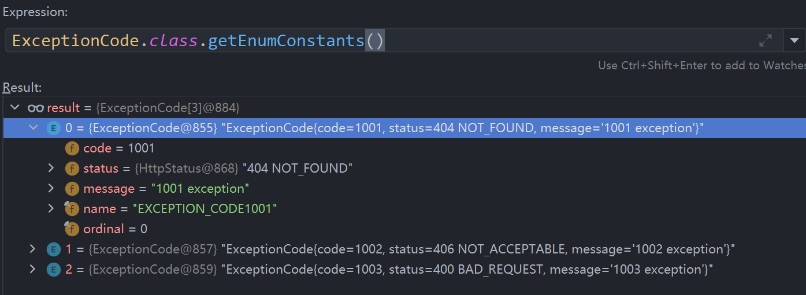

## getEnumConstantsShared

```
T[] getEnumConstantsShared() 
```

Returns 

the elements of this enum class or null if this Class object does not represent an enum type; identical to getEnumConstants except that the result is uncloned, cached, and shared by all callers.

和getEnumConstants区别是，这个方法没有克隆

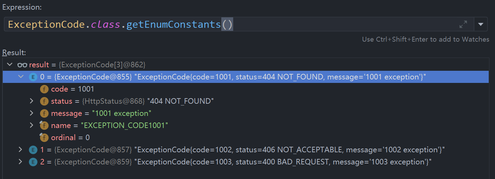

## enumConstantDirectory()

```
Map<String, T> enumConstantDirectory() 
```

Returns a map from simple name to enum constant. This package-private method is used internally by Enum to implement public static <T extends Enum\<T>> T valueOf(Class\<T>, String) efficiently. Note that the map is returned by this method is created lazily on first use. Typically it won't ever get created.

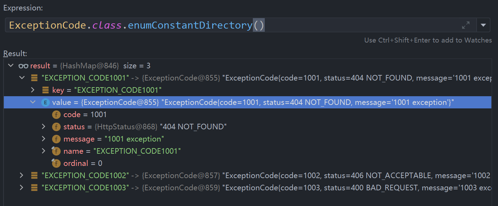

## cast()

```
@SuppressWarnings("unchecked")
public T cast(Object obj) {
    if (obj != null && !isInstance(obj))
        throw new ClassCastException(cannotCastMsg(obj));
    return (T) obj;
}
```

Returns:
the object after casting, or null if obj is null


## cannotCastMsg()

```
private String cannotCastMsg(Object obj) {
    return "Cannot cast " + obj.getClass().getName() + " to " + getName();
}
```

## asSubclass()

```
public <U> Class<? extends U> asSubclass(Class<U> clazz) {
    if (clazz.isAssignableFrom(this))
        return (Class<? extends U>) this;
    else
        throw new ClassCastException(this.toString());
}
```

Params:
clazz – the class of the type to cast this class object to

Type parameters:
\<U> – the type to cast this class object to

Returns:
this Class object, cast to represent a subclass of the specified class object.

## getAnnotation()

```
public <A extends Annotation> A getAnnotation(Class<A> annotationClass) {
    Objects.requireNonNull(annotationClass);

    return (A) annotationData().annotations.get(annotationClass);
}
```

Since:
1.5


## isAnnotationPresent()

```
public boolean isAnnotationPresent(Class<? extends Annotation> annotationClass) {
    return GenericDeclaration.super.isAnnotationPresent(annotationClass);
}
```

Returns 

true if an annotation for the specified type is present on this element, else false. This method is designed primarily for convenient access to marker annotations.

Since:
1.5

## getAnnotations()

```
public Annotation[] getAnnotations() {
    return AnnotationParser.toArray(annotationData().annotations);
}
```

Since:
1.5

## getDeclaredAnnotations()

```
public Annotation[] getDeclaredAnnotations()  {
    return AnnotationParser.toArray(annotationData().declaredAnnotations);
}
```

Since:
1.5

## getDeclaredAnnotation()

```
public <A extends Annotation> A getDeclaredAnnotation(Class<A> annotationClass) {
    Objects.requireNonNull(annotationClass);

    return (A) annotationData().declaredAnnotations.get(annotationClass);
}
```

**Since:**
**1.8**

## getDeclaredAnnotationsByType()

```
public <A extends Annotation> A[] getDeclaredAnnotationsByType(Class<A> annotationClass) {
    Objects.requireNonNull(annotationClass);

    return AnnotationSupport.getDirectlyAndIndirectlyPresent(annotationData().declaredAnnotations,
                                                             annotationClass);
}
```

**Since:**
**1.8**

关于和1.5方法的区别，请参考：

https://blog.csdn.net/javazejian/article/details/71860633#java-8%E4%B8%AD%E6%B3%A8%E8%A7%A3%E5%A2%9E%E5%BC%BA

## getAnnotationsByType()

```
public <A extends Annotation> A[] getAnnotationsByType(Class<A> annotationClass) {
        Objects.requireNonNull(annotationClass);

        AnnotationData annotationData = annotationData();
        return AnnotationSupport.getAssociatedAnnotations(annotationData.declaredAnnotations,
                                                          this,
                                                          annotationClass);
    }
```

**Since:**
**1.8**

## annotationData()

```
private AnnotationData annotationData() {
    while (true) { // retry loop
        AnnotationData annotationData = this.annotationData;
        int classRedefinedCount = this.classRedefinedCount;
        if (annotationData != null &&
            annotationData.redefinedCount == classRedefinedCount) {
            return annotationData;
        }
        // null or stale annotationData -> optimistically create new instance
        AnnotationData newAnnotationData = createAnnotationData(classRedefinedCount);
        // try to install it
        if (Atomic.casAnnotationData(this, annotationData, newAnnotationData)) {
            // successfully installed new AnnotationData
            return newAnnotationData;
        }
    }
}
```

## createAnnotationData()

```
private AnnotationData createAnnotationData(int classRedefinedCount) 
```

## casAnnotationType()

```
boolean casAnnotationType(AnnotationType oldType, AnnotationType newType) {
    return Atomic.casAnnotationType(this, oldType, newType);
}
```

## getAnnotationType()

```
AnnotationType getAnnotationType() {
    return annotationType;
}
```

## getDeclaredAnnotationMap()

```
Map<Class<? extends Annotation>, Annotation> getDeclaredAnnotationMap() {
    return annotationData().declaredAnnotations;
}
```

## getAnnotatedSuperclass()

```
public AnnotatedType getAnnotatedSuperclass() {
    if (this == Object.class ||
            isInterface() ||
            isArray() ||
            isPrimitive() ||
            this == Void.TYPE) {
        return null;
    }

    return TypeAnnotationParser.buildAnnotatedSuperclass(getRawTypeAnnotations(), getConstantPool(), this);
}
```

细节信息强烈推荐查看：https://www.logicbig.com/how-to/code-snippets/jcode-reflection-class-getannotatedsuperclass.html

## getAnnotatedInterfaces()

```
public AnnotatedType[] getAnnotatedInterfaces() {
     return TypeAnnotationParser.buildAnnotatedInterfaces(getRawTypeAnnotations(), getConstantPool(), this);
}
```

Returns:
an array representing the superinterfaces


# native method

## registerNatives()

```java
private static native void registerNatives();
static {
	registerNatives();
}
```

调用本地方native方法初始化

## isInstance()

```
public native boolean isInstance(Object obj);
```

returns:

 true if obj is an instance of this class

## isAssignableFrom()

```
public native boolean isAssignableFrom(Class<?> cls);
```

Returns:

the boolean value indicating whether objects of the type cls can be assigned to objects of this class


## isInterface()

```java
public native boolean isInterface();
```

Returns:
true if this object represents an interface; false otherwise.

## isArray()

```java
public native boolean isArray();
```

Returns:
true if this object represents an array class; false otherwise.

## isPrimitive()

```java
public native boolean isPrimitive();
```

Returns:
true if and only if this class represents a primitive type

## getName0()

```java
private native String getName0();
```

returns: name

getName()方法调用此内部方法

## getSuperclass()

```java
public native Class<? super T> getSuperclass();
```

Returns:
the superclass of the class represented by this object.


## getInterfaces0()

```java
private native Class<?>[] getInterfaces0();
```

## getComponentType()

```java
public native Class<?> getComponentType();
```

Returns:

the Class representing the component type of an array. If this class does not represent an array class this method returns null.


## getModifiers()

```java
public native int getModifiers();
```

Returns:
the int representing the modifiers for this class


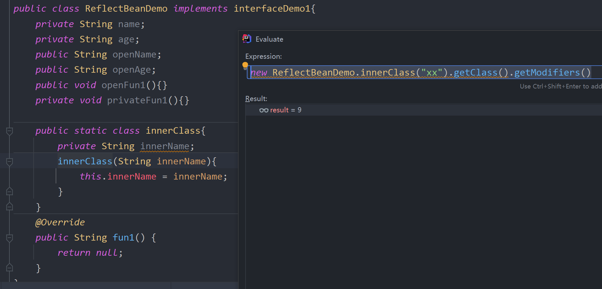

什么都不加 是0 ， public 是1 ，private 是 2 ，protected 是 4，static 是 8 ，final 是 16。

public + static  = 9

## getSigners()

```java
public native Object[] getSigners();
```

Returns:
the signers of this class, or null if there are no signers. In particular, this method returns null if this object represents a primitive type or void.

> 方法签名 - 方法的名称和参数类型
>
> 例如calculateAnswer(double, int, double, double)
>
> 参考：https://blog.csdn.net/li_zhu_7520/article/details/78261493

## setSigners()

```
native void setSigners(Object[] signers);
```

Set the signers of this class.

## getEnclosingMethod0()

```
private native Object[] getEnclosingMethod0();
```

## getDeclaringClass0()

```
private native Class<?> getDeclaringClass0();
```

## getProtectionDomain0()

```
private native java.security.ProtectionDomain getProtectionDomain0();
```

Returns 

the ProtectionDomain of this class.

## getPrimitiveClass()

```
static native Class<?> getPrimitiveClass(String name);
```

Return 

the Virtual Machine's Class object for the namedprimitive type.

## getGenericSignature0()

```
// Generic signature handling
private native String getGenericSignature0();
```

## getRawAnnotations()

```
// Annotations handling
native byte[] getRawAnnotations();
```

## getRawTypeAnnotations()

```
// Since 1.8
native byte[] getRawTypeAnnotations();
```

## getConstantPool()

```
native ConstantPool getConstantPool();
```

## getDeclaredFields0()

```
private native Field[]       getDeclaredFields0(boolean publicOnly);
```

## getDeclaredMethods0()

```
private native Method[]      getDeclaredMethods0(boolean publicOnly);
```

## getDeclaredConstructors0()

```
private native Constructor<T>[] getDeclaredConstructors0(boolean publicOnly);
```

## getDeclaredClasses0()

```
private native Class<?>[]   getDeclaredClasses0();
```

## desiredAssertionStatus0()

```
private static native boolean desiredAssertionStatus0(Class<?> clazz);
```


# Field

## cachedConstructor

```java
private volatile transient Constructor<T> cachedConstructor;
```

## newInstanceCallerCache

```
private volatile transient Class<?>   newInstanceCallerCache;
```

## name

```
private transient String name;
```

## classLoader

```
private final ClassLoader classLoader;
```

## useCaches

```
private static boolean useCaches = true;
```

## SoftReference

```
private volatile transient SoftReference<ReflectionData<T>> reflectionData;
```

## classRedefinedCount

```
private volatile transient int classRedefinedCount = 0;
```

## genericInfo

```
// Generic info repository; lazily initialized
private volatile transient ClassRepository genericInfo;
```

## serialVersionUID

```
private static final long serialVersionUID = 3206093459760846163L;
```

use serialVersionUID from JDK 1.1 for interoperability

## serialPersistentFields

```java
//Class Class is special cased within the Serialization Stream Protocol. A Class instance is written //initially into an ObjectOutputStream in the following format:
//             TC_CLASS ClassDescriptor
//            A ClassDescriptor is a special cased serialization of
//            a  java.io.ObjectStreamClass instance.
//       
// A new handle is generated for the initial time the class descriptor is written into the stream. 
// Future references to the class descriptor are written as references to the initial class descriptor instance.
//See Also: java.io.ObjectStreamClass
private static final ObjectStreamField[] serialPersistentFields = new ObjectStreamField[0];
```

## reflectionFactory

```
private static ReflectionFactory reflectionFactory;
```

## initted

```
private static boolean initted = false;
```

## enumConstants

```
private volatile transient T[] enumConstants = null;
```

## AnnotationData

```
private volatile transient AnnotationData annotationData;
```

## annotationType

```
private volatile transient AnnotationType annotationType;
```

## classValueMap

```
transient ClassValue.ClassValueMap classValueMap;
```


# innerClass

## EnclosingMethodInfo

```java
private final static class EnclosingMethodInfo {
    private Class<?> enclosingClass;
    private String name;
    private String descriptor;

    private EnclosingMethodInfo(Object[] enclosingInfo) {
        if (enclosingInfo.length != 3)
            throw new InternalError("Malformed enclosing method information");
        try {
            // The array is expected to have three elements:

            // the immediately enclosing class
            enclosingClass = (Class<?>) enclosingInfo[0];
            assert(enclosingClass != null);

            // the immediately enclosing method or constructor's
            // name (can be null).
            name            = (String)   enclosingInfo[1];

            // the immediately enclosing method or constructor's
            // descriptor (null iff name is).
            descriptor      = (String)   enclosingInfo[2];
            assert((name != null && descriptor != null) || name == descriptor);
        } catch (ClassCastException cce) {
            throw new InternalError("Invalid type in enclosing method information", cce);
        }
    }
```

## Atomic

```
private static class Atomic
```

Atomic operations support.

## ReflectionData

```
private static class ReflectionData<T>
```

reflection data that might get invalidated when JVM TI RedefineClasses() is called

## MethodArray

```
static class MethodArray
```

## AnnotationData

```
// annotation data that might get invalidated when JVM TI RedefineClasses() is called
private static class AnnotationData {
    final Map<Class<? extends Annotation>, Annotation> annotations;
    final Map<Class<? extends Annotation>, Annotation> declaredAnnotations;

    // Value of classRedefinedCount when we created this AnnotationData instance
    final int redefinedCount;

    AnnotationData(Map<Class<? extends Annotation>, Annotation> annotations,
                   Map<Class<? extends Annotation>, Annotation> declaredAnnotations,
                   int redefinedCount) {
        this.annotations = annotations;
        this.declaredAnnotations = declaredAnnotations;
        this.redefinedCount = redefinedCount;
    }
}
```


# ref

## 关于jdk1.8之后对class中annotation方法的增加

-- todo

## 关于AnnotationType

https://stackoverflow.com/questions/36293911/what-is-annotationannotationtype-good-for

One reason to use annotationType() is if your annotations are implemented using Proxy classes. Object.getClass() would return the proxy class whereas you may want the underlying "real" implementation class.

There are various examples of this, particularly when dependency injection or other heavyweight reflection is involved.

个人理解：AnnotationType类比于Class、Annotation类比于Object

## @CallerSensitive一些理解

https://www.cnblogs.com/makai/p/12857746.html

https://blog.csdn.net/aguda_king/article/details/72355807

## java中五种类

top level class

nested class (静态内部类)

inner class(非静态内部类)

local class(在方法内定义的类)

anonymous class(匿名类)

## refDemo1

```java
import java.lang.reflect.Type;
/**
 * Description:
 * date: 2020-12-18
 *
 * @author xumu
 */
public class refDemo1 {
    private class Food{
        String foodName;
    }
    private interface Eat<T>{
        void eat(T things);
    }
    private interface Run{
        void run();
    }

    private class Dog implements Eat<Food>,Run{
        @Override
        public void run() { }
        @Override
        public void eat(Food things) { }
    }
    public static void main(String[] args) {
        Class<?> clazz = Dog.class;
        Type[] genericInterfaces = clazz.getGenericInterfaces();
        Class<?>[] interfaces = clazz.getInterfaces();
    }
}

```

## refDemo2

```java
public class ClassDemo {

   public Object c;

   public ClassDemo( ) {
      class ClassA{ };
      c = new ClassA( );
   }

   public Object ClassAObject( ) {
      class ClassA{ };
      return new ClassA( );
   }

   public static void main(String[] args) {
     
     Class cls;
     cls = (new ClassDemo()).c.getClass();
         
     System.out.print("getEnclosingConstructor() = ");
     System.out.println(cls.getEnclosingConstructor());
   }
} 
//原文出自【易百教程】，商业转载请联系作者获得授权，非商业请保留原文链接：https://www.yiibai.com/java/lang/class_getenclosingconstructor.html
```

